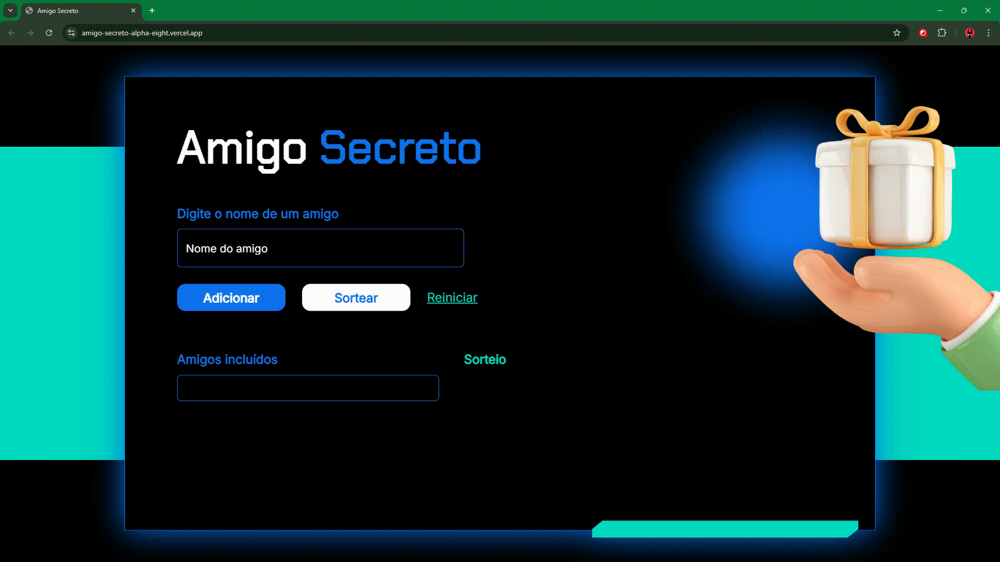
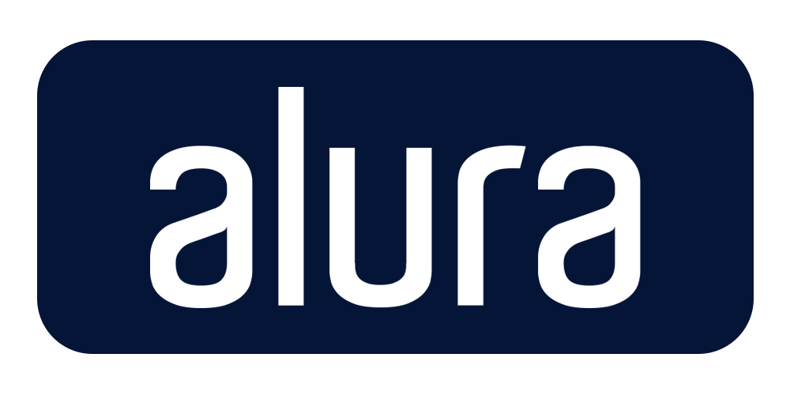

# 🎫 E-Ticket

## 📰 Descrição

Quinto e último projeto do último curso de Lógica de Programação da Alura

Esse projeto apresenta um **sorteador de nomes** para seu Amigo Secreto, onde os nomes são inseridos *ou excluídos* pelo próprio usuário (que também pode reiniciar o sorteio)

> Assim como os últimos, esse projeto continua utilizando de conceitos aprendidos anteriormente, mas também apresenta novos: .splice **(comando que remove elementos de um Array e, se necessário, insere novos elementos no lugar, retornando os deletados)**, document.createElement **(cria uma "tag" no documento HTML)**, .appendChild **(comando que devolve uma referência ao nó adicionado, ou seja, devolve o "elemento criado")**, .addEventListener **(adiciona um evento ao realizar ação específica)**...
> - Esse projeto também conta com alterações individuais e opcionais ao HTML, CSS e JS: adição de uma **classe ao parágrafo de cada nome pelo próprio JS (que ao passar o mouse deixa o texto em vermelho, mostrando que pode ser excluído)**, além de uma modificação no código em JS para **manter o sorteio na tela após excluir um nome** 

## 🔗 Link para vizualização

## 💻 Tecnologias Utilizadas
`Trabalhado durante o curso:`

 

`Modificado para novas implementações OPCIONAIS:`

 

`Desenvolvido anteriormente pela Alura:`

 

## 🏅 Certificado de Conclusão 

## 🙋 Autores
[    Gabriel Possato ](https://github.com/possatogabriel)
 
 

    
